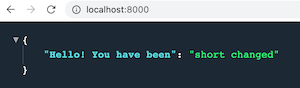
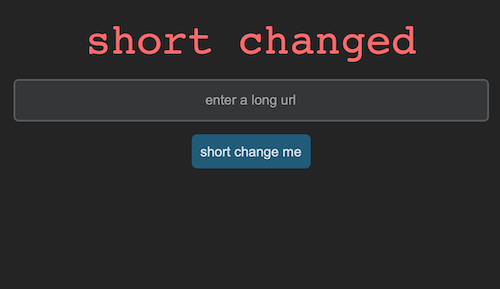

# Short Changed
### A URL Shortener built using Python, FastApi, CustomTkinter and MySQL

This is a response to John Crickett's URL Shortener Coding Challenge.

See the challenge specification [here](https://codingchallenges.fyi/challenges/challenge-url-shortener).

### Installation
- Install fastapi: `pip install fastapi`  
- Install uvicorn: `pip install "uvicorn[standard]"`  
- Install mysql-connector: `pip install mysql-connector-python`
- Install customtkinter: `pip install customtkinter`
- Install validators: `pip install validators`

### Getting Started
- Enter terminal command: `api:shortchanged --reload`  
If successful you should see this message at localhost:8000  

- In database.py file, replace value of password (lines 10 and 18) with your own MySQL password
- Run the main.py file  

